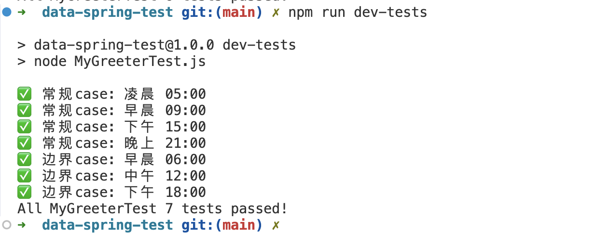
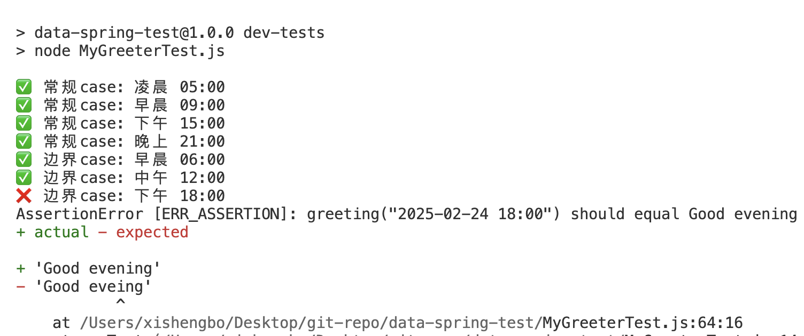

# 1.测试结果预览
## 单测全部通过

## 单测失败一个

# 2.思考
## MyGreeterTest的问题和解决方案
- 问题1: 如果greeting不支持自定义日期，直接从系统获取时间，测试覆盖不全面
解决方案：支持了greeting方法可以传入日期，全面覆盖测试

- 问题2: 没有明确6am 12am 6pm这些时间点的返回情况
解决方案：假定题目中的区间是左闭右开区间，按照这个情况去测试边界情况

- 问题3: 默认单测样式比较单一
解决方案：统计了所有的单测执行情况，优化显示格式

# 3.原始题目
Hello future teammate!
==========

我们用两种常见的编程语言（PHP，Python）准备了一个小测试，
你可以挑选其中一种或者其他你更自信的编程语言来完成这个测试。

动手
----

1. 希望你实现一个类（MyGreeter），满足以下条件：
  - 能够实例化。
  - 实现一个方法（让我们叫他greeting），能够根据不同的运行时间返回不同的消息字符串。
    - 当运行时间在6AM至12AM之间时，返回 "Good morning"。
    - 当运行时间在12AM至6PM之间时，返回 "Good afternoon"。
    - 当运行时间在6PM至第二天6AM之间时，返回 "Good evening"。
  - 在适当的位置编写简明扼要的注释以提高你编写的代码的可读性。

2. 希望你实现的这个类能通过我们预先准备的单元测试类（MyGreeterTest）
   - 我们准备了一个容器运行环境来供你运行单元测试，你需要根据实际情况对它进行改进，至少满足以下条件：
     - `make dev-tests` 这个命令可以在你的环境里运行。
     - 运行结果显示，所有的测试项目都正常通过。
   - 请用注释或者别的方式说明你的每个改进点的意图。
   - 如果你认为这个容器环境不存在值得改进的地方，也请提供用来支撑你这个看法的理由。

思考
----

当你完成上述动手项目后，请进一步思考并回答以下2个问题。

1. 我们准备的单元测试类（MyGreeterTest）是否存在问题？（是或者否）
2. 如果问题1你的答案"是"的话，请问有哪些问题？以及你认为针对每个问题应该如何改善？

结尾
----

当你全部完成后，请将"动手"和"思考"的结果打包提交给HR。
注意：请不要在这个代码仓库里直接提交PR！
